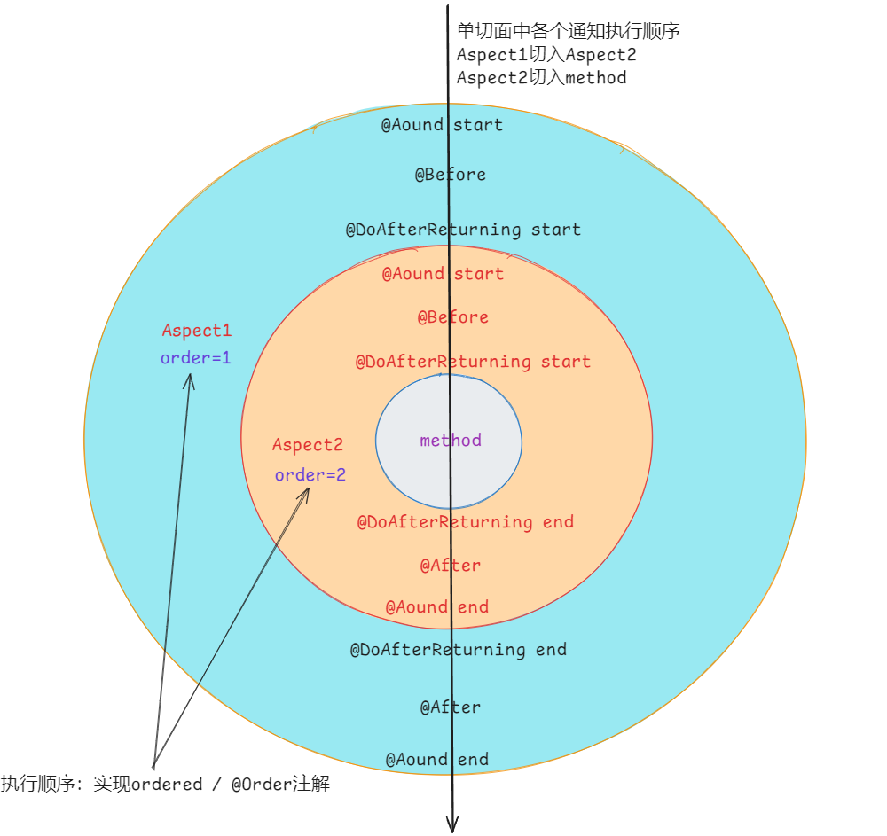
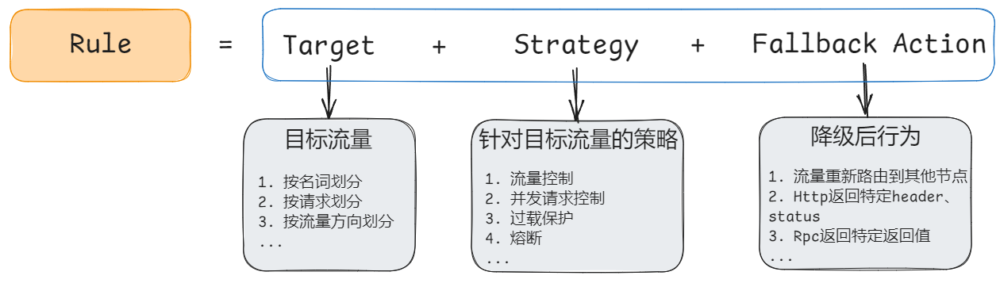

# code-snippet
本仓库整理常用组件的代码片段

# demo-basic
java 基础相关内容

# demo-design-pattern
java 设计模式相关

## demo-dubbo
Springboot-dubbo-nacos

## demo-spring-mvc
SpringBoot-MVC-MybatisPlus
- spring配置
- Filter
- Interceptor
- Mybatis
- 全局异常处理

## demo-spring-aop
用例详见：test/
- aop通知执行顺序
- aop多个切面执行顺序



## demo-spring-transaction
Spring事务相关

## demo-spring-sentinel



[sentinel-dashboard-release包下载地址](https://github.com/alibaba/Sentinel/releases)

```shell
java -jar sentinel-dashboard-1.8.6.jar -Dserver.port=8858 -Dcsp.sentinel.dashboard.server=localhost:8858 -Dproject.name=sentinel-dashboard
```
